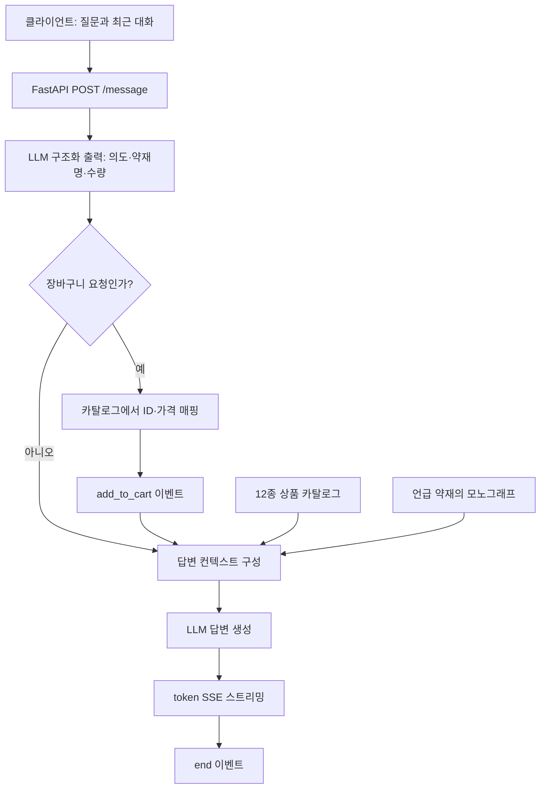

# Palantiny — 한약재 유통 상담 챗봇

> 한약재의 상품·유통 정보와 문헌 지식을 연결하고, 정보 조회부터 장바구니 담기 요청까지 자연어 대화로 이어주는 B2B 챗봇 백엔드입니다.

## 1. 프로젝트 개요

한약재를 구매하는 담당자는 구매 전에 가격뿐 아니라 원산지, 제조사, 포장 중량, 재고, 배송 조건을 함께 확인해야 합니다. 약재의 특성을 확인하려면 효능과 성질 등이 정리된 문헌도 찾아봐야 합니다. 이 프로젝트는 이러한 **상품 정보 확인과 약재 지식 탐색을 하나의 대화 흐름으로 연결**하기 위해 개발했습니다.

사용자는 “감초 가격 알려줘”, “인삼이랑 복령 가격 비교해줘”, “숙지황 효능이 뭐야?”처럼 질문할 수 있습니다. 챗봇은 질문의 의도를 분석하고, 상품 데이터와 약재별 참고 문헌을 답변에 활용합니다. 이어서 “감초 2개 장바구니에 담아줘”라고 요청하면 약재명과 수량을 구조화해 프론트엔드가 처리할 수 있는 이벤트로 전달합니다. 답변은 완성될 때까지 기다렸다가 한 번에 표시하지 않고, **SSE(Server-Sent Events)**로 생성되는 내용을 순차 전송합니다.

이 저장소는 Palantiny 플랫폼 중 **챗봇 전용 서버(Server2)**를 다룹니다. 웹 서비스는 개발 과정에서 Server1으로 분리했으며, 이 저장소의 핵심 책임은 질문 분석, 데이터·지식 결합, 답변 스트리밍, 프론트엔드 연동입니다. 주문·결제 시스템 전체를 구현한 저장소는 아닙니다.

개발 초기에는 한약재의 성질·효능·처방·유통 정보를 관계로 표현하는 **온톨로지와 Neo4j 지식 그래프**를 구축했습니다. 이후 실제 유통 데이터를 외부 DJMEDI API에서 가져오는 구조로 전환하고, 지식 질문과 재고·상품 조회를 나누는 파이프라인을 구현했습니다. 현재 기본 채팅 경로는 **12종의 더미 상품 카탈로그와 70종의 모노그래프 JSON을 활용하는 시연용 구조**입니다. 모노그래프는 개별 약재의 성미·귀경·효능·주치 등을 정리한 자료를 뜻합니다.

**현재 구현 범위**

| 사용자가 할 수 있는 일 | 처리 방식과 범위 |
|---|---|
| 상품 가격·원산지·제조사·중량·재고 상태·배송 문의 | 12종 더미 카탈로그에 있는 값을 답변에 사용 |
| 가격 비교 및 조건에 맞는 상품 문의 | 카탈로그를 LLM에 전달해 비교·설명. 실시간 판매처별 최저가 검색은 아님 |
| 약재의 효능·성미·귀경 등 질문 | 질문에서 추출한 약재명으로 모노그래프를 조회해 답변 근거로 전달 |
| 장바구니 담기 요청 | 약재명·수량을 상품 ID·가격에 매핑해 `add_to_cart` 이벤트 발행. 실제 장바구니 반영은 프론트엔드의 책임 |
| 앞선 질문을 이어서 상담 | 클라이언트가 보낸 `history` 중 최근 메시지 10개 사용 |
| 답변 대기 상태 확인 | `thinking_token`으로 진행 안내를 표시하고, `token`으로 답변을 스트리밍 |

> 이 문서는 `be94aba6`까지의 커밋과 코드를 기준으로 작성했습니다. 아래의 과거 구현 사례는 현재 기본 채팅 경로에서 모두 활성화되어 있다는 뜻이 아닙니다. 커밋에 명시된 문제와 변경 코드를 근거로 설명하며, 측정 자료가 없는 속도·비용·정확도 개선 수치는 제시하지 않습니다.

## 2. 아키텍처가 발전한 과정

| 시기 | 구조 | 주요 변화 |
|---|---|---|
| 2026.03 | FastAPI + Redis MQ + 다단계 LLM 파이프라인 | 메시지 접수, 워커 처리, SQL 실행, SSE 전달을 분리. MongoDB에 대화 저장 |
| 2026.03 말~04 초 | 고정 워커 + AWS 이전 | 채팅 워커 3개와 SQL 워커 1개를 별도 프로세스로 구성. MongoDB → DynamoDB 이전, 웹 서버 분리 |
| 2026.04 초 | Neo4j 지식 그래프 | 약재 지식과 유통 정보의 관계 탐색, 복수 의도 검색, 2-hop 탐색, 상품 연결 및 그래프 결과 캐싱 |
| 2026.04.16~05 | DJMEDI API 기반 파이프라인 | 엔티티 추출 → BM25 정규화 → 라우팅 → 데이터 조회 → 답변 생성. 지식 우선·DB 우선 분기와 상품 카드 SSE 도입 |
| 2026.06~현재 | 더미데이터 기반 직접 SSE | 요청 큐를 우회하고 POST 응답에서 직접 스트리밍. 카탈로그·모노그래프 기반 상담과 장바구니 이벤트에 집중 |

### 현재 채팅 요청의 처리 흐름



핵심 코드는 [`chatbot_pipeline.py`](app/services/chatbot_pipeline.py)입니다.

1. **요청 분석:** OpenAI Structured Output과 Pydantic 스키마로 `chat` 또는 `add_to_cart`, 약재명, 수량을 추출합니다. 라우팅 실패 시 일반 상담으로 처리합니다.
2. **동작 데이터 구성:** 장바구니 요청은 서버가 카탈로그에서 상품을 다시 찾습니다. 판매 목록에서 찾지 못한 항목은 제외하고, 0 이하의 수량은 1로 보정합니다.
3. **근거 결합:** 전체 카탈로그, 언급·장바구니 약재의 모노그래프, 최근 대화, 장바구니 이벤트에 담은 내역을 답변 프롬프트에 넣습니다.
4. **응답 전달:** 비동기 제너레이터가 이벤트를 생성하고 FastAPI의 `StreamingResponse`가 SSE로 전송합니다. 라우팅 대기 및 완료 시점에는 진행 안내도 전달합니다.

현재 `thinking_token`은 코드에 정의된 문구와 라우팅 결과로 만든 **사용자용 진행 안내**입니다. 모델 내부 추론을 그대로 공개하는 기능은 아닙니다.

### 이전 DJMEDI 연동 구조

```text
사용자 질문
  → LLM1: 약재·제조사·원산지 등의 엔티티 추출
  → BM25: 별칭을 API 검색에 사용할 표준 값으로 정규화
  → LLM2: 조회 계획 결정
      ├─ KNOWLEDGE_FIRST: 문헌 기반 답변 → 관련 약재 조회 → 상품 카드
      ├─ DB_FIRST: DJMEDI 조회 → 데이터 기반 답변 → 조회 결과 카드
      └─ SQL: Redis Queue → SQL 워커 → 답변
  → token / herb_card 이벤트 전달
  → end 이벤트
```

[`pipeline.py`](app/services/pipeline.py), [`djmedi_service.py`](app/services/djmedi_service.py), 워커 모듈에 남아 있는 이전 구현입니다. 현재 채팅 API는 이 경로를 호출하지 않으며, 재활성화하려면 프롬프트·워커·테스트의 호환성부터 복구해야 합니다.

## 3. 주요 문제 해결 과정

### 3.1 최신 가격이 없는데 과거 가격을 현재 가격처럼 안내하는 문제

**문제와 원인**

Neo4j 조회 결과를 LLM용 텍스트로 바꿀 때 `price_per_geun`이 `None`인 행을 건너뛰었습니다. 최신 월의 가격이 비어 있으면 해당 월 자체가 컨텍스트에서 사라져, LLM이 남아 있는 이전 월의 가격을 최신 가격으로 오인할 수 있었습니다.

**해결 방법**

- 프롬프트에 가격 기준 월을 표시하고, 최신 월이 `null`이면 과거 가격으로 대체하지 않도록 명시했습니다.
- 조회 결과를 가공하는 코드에서도 누락 행을 제거하지 않고 `근당가격=가격정보없음`과 해당 월을 함께 전달했습니다.
- 유통 정보, 제조사별 조회, 원산지별 조회, 가격 이력 등 관련 템플릿에 같은 처리를 적용했습니다.

**핵심:** “추측하지 말라”는 프롬프트만으로는 부족했습니다. 모델이 결측 사실을 알 수 있도록 **입력 데이터에서 결측과 기준 시점을 보존**해야 했습니다. 현재 더미 카탈로그는 월별 가격 이력을 조회하지 않으므로, 이 사례는 그래프 기반 단계의 해결 이력입니다.

근거: [가격 최신성 규칙](https://github.com/palantiny/herbal-medicine-distribution-chatbot/commit/9b1986bd), [null 가격 행 보존](https://github.com/palantiny/herbal-medicine-distribution-chatbot/commit/07233adb)

### 3.2 상품 링크 오류와 카드 형식 불안정

**문제와 원인**

초기 상품 링크는 SQL 테이블의 `md_seq`를 기준으로 만들었지만, 상품 연결에 필요한 식별자는 그래프 조회 결과의 `product_id`였습니다. 이후 LLM이 직접 `herb-card` 마크업을 작성하도록 바꾸는 과정에서는 카드 형식 인식 문제, 내부 ID의 본문 노출, 숫자 필드에 `원`이 섞여 발생하는 `NaN` 문제가 이어졌습니다.

**해결 방법**

1. 그래프 결과에 `[product_id=...]`를 명확히 포함하고 링크 생성 기준을 일치시켰습니다.
2. 카드 예시의 백틱 이스케이프를 정리하고, 카드 출력 조건과 내부 식별자 비노출 규칙을 보강했습니다.
3. 가격 컨텍스트에서 `원` 단위를 제거해 카드의 숫자 필드에 들어갈 값과 표시용 단위를 분리했습니다.
4. DJMEDI 단계에서는 LLM에 카드 마크업을 맡기지 않고 **서버가 구조화된 `herb_card` SSE 이벤트를 발행**하도록 바꿨습니다.

`DB_FIRST`는 이미 조회한 원본 항목을 보존해 카드에 재사용합니다. `KNOWLEDGE_FIRST`는 답변의 약재명을 추출한 뒤 상품을 조회하며, 고객 코드가 있으면 고객 보유 약재를 우선 조회합니다. 안내용 `notice`는 카드에서 제외하고, 카드 발행이 끝난 뒤 `end`를 보냅니다. 두 경로와 SQL의 카드 미발행 동작을 검증하는 테스트도 추가했습니다.

**핵심:** 자연어 설명과 UI용 데이터의 책임을 나눴습니다. 현재 장바구니 이벤트도 LLM이 반환한 이름을 서버가 실제 카탈로그 ID·가격에 매핑하는 방식입니다.

근거: [상품 식별자 수정](https://github.com/palantiny/herbal-medicine-distribution-chatbot/commit/a9bb22cc), [카드 형식 수정](https://github.com/palantiny/herbal-medicine-distribution-chatbot/commit/ac0de31b), [가격 NaN 방지](https://github.com/palantiny/herbal-medicine-distribution-chatbot/commit/7bb4c1c5), [카드 SSE 통일](https://github.com/palantiny/herbal-medicine-distribution-chatbot/commit/df26169c), [카드 테스트](https://github.com/palantiny/herbal-medicine-distribution-chatbot/commit/0c338764)

### 3.3 직접 관리하던 약재 데이터와 외부 유통 데이터의 연결

**변경 배경**

기존 구조는 Neo4j와 로컬 PostgreSQL 약재 테이블을 조회했습니다. 이후 약재 데이터를 직접 저장·관리하는 방식에서 DJMEDI API를 통해 가져오는 방식으로 바뀌면서, 데이터 소스에 맞게 검색과 라우팅을 재설계했습니다. 이는 특정 DB 장애를 해결한 사례가 아니라 **데이터 공급 방식 변경에 따른 아키텍처 전환**입니다.

**해결 방법**

- Neo4j 조회 모듈과 기존 로컬 캐시 서비스를 제거하고 DJMEDI 클라이언트로 조회 책임을 모았습니다.
- 제조사 목록(`herbmaker`), 제조사별 약재(`herbmedicine`), 고객 보유 약재(`membermedicine`)를 호출하도록 구성했습니다.
- 엔티티 추출 → 정규화 → 조회 계획 → 실행 → 답변 합성의 순차 비동기 함수로 파이프라인을 정리했습니다.
- API별로 제조사 24시간, 상품 1시간, 고객 보유 약재 30분의 Redis 캐시를 두었습니다. 따라서 API 기반 구조도 매 요청마다 원본을 새로 조회하는 것은 아닙니다.
- API가 제공하지 않는 원산지 조건 등은 필터링한 것처럼 답하지 않도록 `notice`로 제약을 전달했습니다.

**핵심:** 데이터의 출처가 바뀌면 조회 코드뿐 아니라 검색 가능한 조건, 캐시 정책, 답변에 전달할 제약도 함께 바뀌어야 합니다.

근거: [DJMEDI 전환](https://github.com/palantiny/herbal-medicine-distribution-chatbot/commit/d11f42cd), [API 응답 검증](https://github.com/palantiny/herbal-medicine-distribution-chatbot/commit/d88a87c0), [당시 설계 기록](docs/pipeline-refactor.md)

### 3.4 “중국산”이 “국산”으로 매칭되는 검색 정규화 문제

**문제와 원인**

사용자가 입력하는 제조사·원산지 표현과 데이터의 표기가 다르므로 별칭 검색이 필요했습니다. 하지만 짧은 한국어를 2글자 단위로 나누면 `중국산` 안의 `국산`이 국내산 별칭과 잘못 매칭될 수 있었습니다.

**해결 방법**

BM25 별칭 검색에서 한글 길이가 4자 이상일 때만 bigram을 추가하도록 했습니다. 또한 점수 임계값 `0.5` 미만의 약한 매칭을 제외하고, `CK` 같은 제조사 별칭과 실제 API 표기의 대응을 보강했습니다.

**핵심:** 자연어 검색에서는 부분 문자열의 유사성이 실제 의미의 일치를 보장하지 않습니다. 특히 원산지처럼 구매 판단을 바꾸는 조건은 토큰화 단계부터 오매칭을 줄여야 합니다.

근거: [정규화 모듈 도입](https://github.com/palantiny/herbal-medicine-distribution-chatbot/commit/d11f42cd), [제조사 별칭 보강](https://github.com/palantiny/herbal-medicine-distribution-chatbot/commit/3062d801), [`scheme_resolver.py`](app/services/scheme_resolver.py)

### 3.5 지식 질문과 재고 질문을 같은 방식으로 처리하던 구조 개선

**설계 과제**

“감초의 특성은?”과 “내 감초 재고는?”은 필요한 근거가 다릅니다. 전자는 문헌을 활용할 수 있지만, 후자는 고객별 데이터 조회가 선행되어야 합니다. 약재명이 없는 “내 전체 재고 보여줘”도 특정 약재 검색만으로는 처리하기 어렵습니다.

**해결 방법**

- `KNOWLEDGE_FIRST`와 `DB_FIRST`로 라우팅을 구분했습니다.
- 약재별 원문을 정제한 70종 모노그래프 JSON을 만들고, 약재명으로 조회해 답변 프롬프트에 주입했습니다. 당시 답변 프롬프트에는 일반 지식과 충돌하면 모노그래프를 우선하도록 규칙을 넣었습니다.
- 지식 답변 뒤에는 언급 약재의 상품 카드를 별도로 붙일 수 있도록 했습니다.
- `get_my_full_inventory` 의도와 `list_user_medicines()`를 추가해 약재명 없는 전체 재고 요청을 처리했습니다. 챗봇 범위를 벗어난 요청에 대한 채널 안내도 프롬프트에 추가했습니다.

**핵심:** 질문이 요구하는 근거에 따라 조회 순서를 결정했습니다. 현재 단순화된 경로에서는 질문·장바구니 항목에서 추출한 약재명으로 모노그래프를 조회하며, 답변 이후의 약재명 추출과 상품 카드 부착은 사용하지 않습니다.

근거: [지식 우선 흐름](https://github.com/palantiny/herbal-medicine-distribution-chatbot/commit/40f1b8f9), [모노그래프 서비스](https://github.com/palantiny/herbal-medicine-distribution-chatbot/commit/24de21e4), [전체 재고 조회](https://github.com/palantiny/herbal-medicine-distribution-chatbot/commit/d5654c67), [전체 재고 테스트](https://github.com/palantiny/herbal-medicine-distribution-chatbot/commit/e153acd4)

### 3.6 외부 API의 `null` 값 때문에 발생한 TypeError

**문제와 원인**

약재명을 찾는 코드에서 `herb_name in item.get("md_name", "")`를 사용했습니다. `dict.get()`의 기본값은 키가 없을 때만 적용되므로, API가 `{"md_name": null}`을 반환하면 포함 검사를 `None`에 수행해 `TypeError`가 발생했습니다.

**해결 방법**

`herb_name in (item.get("md_name") or "")`로 수정해 누락 키와 명시적인 `null`을 모두 빈 문자열로 처리했습니다.

**핵심:** 외부 응답에서는 “필드가 없음”과 “필드는 있지만 값이 null”을 모두 고려해야 합니다. 오류가 발생한 문자열 비교 지점에 필요한 보정을 적용했습니다.

근거: [None-safe 처리](https://github.com/palantiny/herbal-medicine-distribution-chatbot/commit/649ccd3b)

### 3.7 반복 조회와 요청 처리 구조 개선

**문제·개선 배경**

동일한 의도와 약재 조건으로 Neo4j를 반복 조회하면 같은 쿼리를 다시 실행하게 됩니다. 초기에는 서버 시작 시 데이터를 Redis에 사전 적재했으며, 이후에는 실제 접근 빈도에 따라 캐시하는 방식으로 변경했습니다.

**해결 방법**

- 3월에는 24시간 접근 카운터를 두고, 2회 이상 조회된 약재만 1시간 캐시에 적재하도록 변경했습니다.
- 4월에는 그래프 검색 의도와 정렬된 노드 목록으로 캐시 키를 만들어 입력 순서가 달라도 같은 검색 결과를 재사용하도록 했습니다. 조회 오류나 설정 누락 메시지는 캐시하지 않았습니다.
- 요청 처리 측면에서는 FastAPI 내부에서 시작하던 워커를 별도 프로세스로 옮기고 채팅 워커 3개·SQL 워커 1개를 구성했습니다. API와 워커의 실행 단위를 분리한 변경이며, 처리량 증가 수치를 측정한 기록은 없습니다.

**핵심:** 캐시에는 무엇을 같은 요청으로 볼지와 어떤 결과를 저장하지 않을지가 중요합니다. 현재 직접 SSE 채팅은 이 워커·그래프 캐시 경로를 우회합니다.

근거: [접근 빈도 캐싱](https://github.com/palantiny/herbal-medicine-distribution-chatbot/commit/50d2182d), [그래프 중복 조회 방지](https://github.com/palantiny/herbal-medicine-distribution-chatbot/commit/01e82e53), [고정 워커 분리](https://github.com/palantiny/herbal-medicine-distribution-chatbot/commit/56bc8a5b)

### 3.8 배포 명령 실행과 완료 확인 문제

**문제와 원인**

배포 방식은 SSH → SSM → CodeDeploy 순으로 변경되었습니다. SSM 단계에서는 명령 실행 사용자, 완료 대기, 실패 로그 확인을 수정하는 커밋이 이어졌습니다. 대기 명령에서 먼저 종료되면 이후 오류 로그를 확인하기 어려웠고, 명령을 전달하는 것과 실제 배포 성공을 확인하는 절차도 구분할 필요가 있었습니다.

**해결 방법**

- SSM 명령을 `ubuntu` 사용자로 실행하도록 변경했습니다.
- 대기 실패 뒤에도 로그를 확인하도록 보완하고, 이후 최대 20분 동안 상태를 폴링하는 방식으로 변경했습니다.
- Docker 빌드의 `--no-cache` 옵션을 제거했습니다.
- 최종적으로 GitHub Actions에서 소스를 S3에 업로드하고 CodeDeploy 배포를 생성한 뒤 성공 상태를 기다리도록 구성했습니다.
- `appspec.yml`과 `after_install.sh`로 파일 복사·컨테이너 재빌드·재기동 절차를 명시했습니다. Server2 PostgreSQL 컨테이너 이름도 분리했습니다.

**핵심:** 배포 요청 접수, 실행 환경, 실패 로그, 완료 상태를 함께 관리해야 합니다. 현재 스크립트는 컨테이너를 내린 뒤 다시 올리는 방식으로, 무중단 배포나 애플리케이션 수준의 자동 검증까지 구현한 것은 아닙니다.

근거: [실행 사용자 수정](https://github.com/palantiny/herbal-medicine-distribution-chatbot/commit/6fe79a65), [실패 로그 보완](https://github.com/palantiny/herbal-medicine-distribution-chatbot/commit/7f4acbb9), [배포 대기 개선](https://github.com/palantiny/herbal-medicine-distribution-chatbot/commit/070793d8), [CodeDeploy 전환](https://github.com/palantiny/herbal-medicine-distribution-chatbot/commit/db4dd4c7), [컨테이너명 분리](https://github.com/palantiny/herbal-medicine-distribution-chatbot/commit/aad127b9)

### 3.9 모델 교체 후 API 파라미터 호환성 수정

GPT 모델을 `gpt-5.4-mini`로 바꾼 뒤, 이전 파이프라인의 진행 안내 스트리밍 호출에서 `max_tokens`를 `max_completion_tokens`로 변경했습니다. 모델명 교체와 별개로 호출 파라미터도 해당 호출 방식에 맞춰 조정한 사례입니다. 이 변경만으로 모든 모델 옵션의 호환성을 검증했다고 볼 수는 없습니다.

근거: [모델 교체](https://github.com/palantiny/herbal-medicine-distribution-chatbot/commit/039505bb), [토큰 제한 파라미터 수정](https://github.com/palantiny/herbal-medicine-distribution-chatbot/commit/a6b46e7d)

### 3.10 시연 경로 단순화와 답변 대기 경험 개선

**변경 배경**

6월에는 유통 상담·효능 안내·가격 비교·장바구니 흐름을 더미데이터로 제공하도록 전환했습니다. 기록상 확인되는 것은 이 기능 전환과 인프라 의존성 축소이며, 특정 운영 장애가 전환의 원인이었다고 단정하지 않습니다.

**해결 방법**

- 메시지를 큐에 넣은 뒤 별도 GET 스트림으로 받던 구조를, POST가 직접 SSE를 반환하는 구조로 바꿨습니다.
- 대화 이력은 클라이언트가 요청에 포함하고, 현재 채팅 경로는 Redis·워커·DynamoDB·DJMEDI 조회를 사용하지 않도록 했습니다.
- PostgreSQL·Redis 등 인프라 초기화가 실패해도 기본 채팅 서버의 시작을 계속하도록 했습니다. 인증·캐시 API까지 인프라 없이 동작한다는 의미는 아닙니다.
- 라우팅을 비동기 작업으로 시작하고 대기 중 진행 문구를 글자 단위로 전달했습니다. 이후 글자당 지연을 0.05초로 조정했습니다.
- 취소선·HTML 태그를 출력하지 않도록 프롬프트를 보강했습니다. 프롬프트 규칙이며 별도 HTML 필터 구현은 아닙니다.

**핵심:** 현재 기능에 필요한 실행 경로를 단순하게 만들고 진행 상태를 표시했습니다. 다만 이전 워커·UI·테스트가 함께 남아 있어, 후속 정리가 필요한 상태입니다.

근거: [더미데이터·직접 SSE 전환](https://github.com/palantiny/herbal-medicine-distribution-chatbot/commit/34ff4001), [진행 안내 스트리밍](https://github.com/palantiny/herbal-medicine-distribution-chatbot/commit/929bc8b4), [타이핑 속도 조정](https://github.com/palantiny/herbal-medicine-distribution-chatbot/commit/263f8b6e), [출력 형식 규칙](https://github.com/palantiny/herbal-medicine-distribution-chatbot/commit/eb941906)

## 4. 사용 기술과 프레임워크

### 현재 기본 채팅 경로

| 기술 | 무엇이며, 어디에 사용하는가 |
|---|---|
| **Python 3.11** | Docker 이미지 기준 실행 언어. `async/await`와 비동기 제너레이터로 LLM 응답을 기다리고 스트리밍 |
| **FastAPI** | Python API 프레임워크. 요청 스키마 검증, 채팅·인증·캐시 라우트, SSE 응답 제공 |
| **Uvicorn** | FastAPI 애플리케이션을 실행하는 ASGI 서버 |
| **Pydantic / pydantic-settings** | 요청·LLM 구조화 출력의 자료형을 정의하고 환경변수 기반 설정을 로드 |
| **OpenAI Python SDK** | 현재 라우팅·답변에 코드상 `gpt-5.4-mini` 사용. Structured Output으로 의도와 항목을 파싱하고 답변을 스트리밍 |
| **SSE** | HTTP 연결에서 서버가 이벤트를 순차 전송하는 방식. 진행 안내, 장바구니 데이터, 답변, 종료를 유형별로 전달 |
| **JSON 모노그래프** | 70종 약재의 정제 지식. 메모리에 로드한 뒤 약재명으로 조회해 프롬프트에 삽입. 현재 경로는 벡터 검색을 사용하지 않음 |

### 인프라·이전 파이프라인·개발 도구

| 기술 | 역할 및 현재 사용 범위 |
|---|---|
| **PostgreSQL 15 / SQLAlchemy 2 / asyncpg** | 관계형 사용자 데이터와 비동기 DB 접근. 현재 인증 API의 사용자 조회에 필요 |
| **Redis 7** | 이전 구조의 Queue·Pub/Sub·조회 결과 캐시. 캐시 관리 API와 Compose에 남아 있으며 현재 채팅 경로에서는 우회 |
| **AWS DynamoDB / aioboto3** | MongoDB를 대체한 대화 이력 저장소와 비동기 AWS 접근. 이력 저장 모듈과 인증 시 이력 조회에 사용; 현재 채팅은 영구 저장하지 않음 |
| **httpx** | DJMEDI 외부 API를 비동기로 호출하는 HTTP 클라이언트 |
| **BM25 / rank-bm25** | 단어 일치와 빈도를 활용하는 검색 방식. 이전 API 파이프라인에서 약재·제조사·원산지 별칭 정규화 |
| **Neo4j AuraDB / Cypher** | 과거 한약재 온톨로지의 관계 저장·탐색에 사용한 그래프 DB와 쿼리 언어. 해당 조회 모듈은 API 전환 시 제거 |
| **LangGraph / langchain-core** | 초기 다단계 LLM 흐름의 상태·노드 연결에 사용. 이후 순차 비동기 함수로 전환했으며 의존성 목록에는 남아 있음 |
| **tiktoken** | 이전 이력 관리 경로에서 토큰 수를 계산하고 설정 한도 초과 시 요약 여부 판단 |
| **pypdf** | 개발 초기 문헌 PDF 텍스트 추출용 의존성. 현재 모노그래프 빌더는 원본 `.txt`를 읽어 구조화 |
| **Docker / Docker Compose** | 앱과 DB·Redis·워커 실행 구성을 컨테이너로 정의 |
| **GitHub Actions / S3 / CodeDeploy / EC2** | 소스 패키징, 배포 번들 저장, 서버 배포 및 컨테이너 실행 |
| **pytest / pytest-asyncio** | 동기·비동기 단위 테스트. 모노그래프, 약재명 추출, 전체 재고, 라우팅·카드 분기 검증 |

버전 범위는 [`requirements.txt`](requirements.txt), 컨테이너 버전은 Docker 설정을 기준으로 합니다. 의존성 목록에 있다는 사실과 현재 채팅에서 실제 호출한다는 사실은 구분해야 합니다.

## 5. API와 프론트엔드 연동

| 메서드 | 경로 | 설명 |
|---|---|---|
| POST | `/api/v1/chat/{session_id}/message` | `message`, 선택적 `history`를 받아 SSE 직접 반환 |
| DELETE | `/api/v1/chat/{session_id}/history` | 호환용 응답만 반환. 실제 삭제는 클라이언트에서 처리 |
| POST | `/api/v1/auth/verify` | `partner_token` 형식 검사와 PostgreSQL 사용자 조회 후 세션·사용자 ID·고객 코드·최근 이력 반환 |
| GET | `/api/v1/cache/stats` | 이전 DJMEDI 캐시 통계 조회. Redis 필요 |
| DELETE | `/api/v1/cache`, `/api/v1/cache/makers`, `/api/v1/cache/medicines`, `/api/v1/cache/members` | 전체 또는 종류별 캐시 무효화. Redis 필요 |
| GET | `/health` | 서버 응답 상태 확인. 외부 서비스의 정상 여부까지 검사하지 않음 |

```bash
curl -N -X POST http://localhost:8000/api/v1/chat/demo/message \
  -H 'Content-Type: application/json' \
  -d '{
    "message": "감초 2개 장바구니에 담아줘",
    "history": [
      {"role": "user", "content": "감초 가격 알려줘"},
      {"role": "assistant", "content": "감초는 600g 기준 48,000원입니다."}
    ]
  }'
```

일반적인 이벤트 흐름은 `thinking_token` → 선택적 `add_to_cart` → `token` → `end`입니다. 이벤트마다 빈 줄로 구분합니다.

```text
data: {"type":"thinking_token","content":"질"}

data: {"type":"add_to_cart","items":[{"herb_id":"1","herb_name":"감초","price":48000,"quantity":2}]}

data: {"type":"token","content":"감초"}

data: {"type":"end","content":""}

```

프론트엔드는 POST 응답의 스트림을 읽어 이벤트별로 처리해야 합니다. 라우터 예외 시 `error` 후 `end`가 전달되며, 답변 생성 함수 내부에서 처리한 오류는 안내 문장이 `token`으로 전달될 수도 있습니다.

현재 채팅 라우트는 `session_id`를 인증 검증에 사용하지 않으며, 호환용 `user_id`·`cfcode`도 사용하지 않습니다. 별도 인증 API가 존재하더라도 현재 채팅 접근 제어와 연결되어 있지는 않습니다.

## 6. 프로젝트 구조

```text
app/
├── chatbot_main.py                 # FastAPI 진입점
├── api/v1/
│   ├── chat.py                     # 현재 POST SSE API
│   ├── auth.py                     # 파트너 토큰과 사용자 조회
│   └── cache.py                    # 이전 API 조회 캐시 관리
├── core/                          # 환경 설정, DB·Redis 연결, 보안 헬퍼
├── data/
│   ├── dummy_herbs.py              # 현재 판매 카탈로그 12종
│   ├── herb_monographs.json        # 정제 모노그래프 70종
│   └── scheme_aliases.json         # 이전 파이프라인의 검색 별칭
├── services/
│   ├── chatbot_pipeline.py         # 현재 라우팅·장바구니·답변 생성
│   ├── monograph_service.py        # 모노그래프 조회·포맷팅
│   ├── pipeline.py                 # 이전 DJMEDI 파이프라인
│   ├── djmedi_service.py           # 외부 API와 캐싱
│   ├── entity_extractor.py         # 이전 엔티티 추출
│   ├── scheme_resolver.py          # BM25 정규화
│   ├── herb_mention_extractor.py   # 이전 답변의 약재명 추출
│   ├── history_manager.py          # 이전 대화 토큰 관리·요약
│   └── ...                        # 이전 서비스·워커 처리
├── models/                        # ORM 모델
├── repositories/                  # DynamoDB 이력 접근
├── workers/                       # 이전 워커 실행 진입점
└── utils/prompts.py                # 현재 라우터·답변 프롬프트
scripts/
├── build_monographs.py             # 원문 텍스트 → JSON 정제
├── verify_djmedi_api.py             # 외부 API 응답 검증
└── after_install.sh                # CodeDeploy 실행 스크립트
tests/                             # 단위 테스트
.github/workflows/deploy.yml        # main push 배포 워크플로
```

모노그래프 원본 `monograph/*.txt`는 빌더가 요구하지만, 이 기준 커밋에는 포함되어 있지 않습니다. 제공된 JSON은 바로 조회할 수 있으며, 재생성하려면 원문을 별도로 준비해야 합니다. `CLAUDE.md`와 일부 `docs/`는 이전 아키텍처의 기록이므로 현재 실행 경로는 코드와 이 README를 함께 확인해야 합니다.

## 7. 실행 방법

### 기본 채팅 서버

Python 3.11 환경과 OpenAI API 키를 준비합니다.

```bash
git clone https://github.com/palantiny/herbal-medicine-distribution-chatbot.git
cd herbal-medicine-distribution-chatbot
python3 -m venv .venv
source .venv/bin/activate
python -m pip install -r requirements.txt
```

루트에 `.env`를 만들고 키를 설정합니다.

```dotenv
OPENAI_API_KEY=your-openai-api-key
```

```bash
python -m uvicorn app.chatbot_main:app --reload
```

PostgreSQL·Redis 초기화에 실패해도 기본 채팅 경로는 계속 시작하도록 작성되어 있습니다. 다만 인증 API는 PostgreSQL 사용자 데이터가 필요하고, 캐시 API는 Redis가 필요합니다.

### Docker로 기본 채팅 경로 실행

```bash
docker compose up -d --build chatbot_app
```

위 명령은 `chatbot_app`과 의존 서비스 PostgreSQL·Redis를 실행합니다. 전체 Compose를 실행하면 이전 `chat_worker`와 `sql_worker`까지 포함되므로 현재 기본 채팅 확인에는 앱 서비스만 지정합니다.

Dockerfile의 기본 CMD는 현재 존재하지 않는 `app.main:app`을 참조합니다. Compose는 이를 `app.chatbot_main:app`으로 덮어쓰므로, 이미지를 단독 실행할 때도 올바른 진입점을 명시해야 합니다.

`chatbot_ui.html`은 이전 `GET /stream`과 `EventSource`를 사용하는 테스트 UI입니다. 현재 POST SSE 응답 방식에 맞게 수정되어 있지 않으므로, 위 `curl` 예시로 먼저 확인하거나 프론트엔드를 현재 계약에 맞춰 연동해야 합니다.

## 8. 배포 구성

```text
main 브랜치 push
  → GitHub Actions: 소스 ZIP 생성
  → S3: 배포 번들 업로드
  → CodeDeploy: 배포 생성 및 성공 상태 대기
  → EC2: appspec.yml에 따라 파일 복사
  → after_install.sh: Compose down → build → up -d
```

워크플로에는 AWS 인증 및 CodeDeploy 관련 GitHub Secrets가 필요합니다. 서버에는 `.env.prod`, Docker Compose, CodeDeploy 실행 환경을 준비해야 합니다. 현재 배포 스크립트는 전체 Compose를 실행하므로 이전 워커의 호환성 문제도 배포 구성 정리 대상입니다. 워크플로에 `pytest` 실행이나 배포 후 `/health` 검사 단계는 없습니다.

## 9. 테스트와 확인된 한계

```bash
python -m pytest -q
```

README 작성 시 기준 커밋을 로컬 Python 3.13 환경에서 실행한 결과는 **14개 통과, 8개 실패**입니다. Docker 기준 Python 3.11에서의 재검증 및 실제 OpenAI·DJMEDI·AWS 연동 테스트는 수행하지 않았습니다.

| 테스트 영역 | 확인 결과 |
|---|---|
| 모노그래프 조회·포맷팅, 약재명 추출, 전체 재고 관련 테스트 | 총 14개 통과 |
| 이전 파이프라인 라우팅·카드 후처리 테스트 | 총 8개 실패. `pipeline.py`가 현재 `prompts.py`에서 제거된 `LLM2_SYSTEM_PROMPT` 등을 import |

실패는 README 변경으로 발생한 것이 아니라 현재 저장소에 남아 있는 이전 파이프라인과 새 프롬프트 간 불일치입니다. 이 테스트 결과를 현재 기본 채팅의 실제 LLM 응답 품질이나 운영 정상 동작을 검증한 결과로 해석해서는 안 됩니다.

현재 남아 있는 범위와 제약은 다음과 같습니다.

- **실제 거래 연동:** 현재 상품 가격·재고·배송은 더미 값입니다. 장바구니 이벤트 이후 실제 반영 확인, 주문 저장, 결제, 재고 차감은 이 경로에 구현되어 있지 않습니다.
- **데이터 비교:** 상품마다 포장 중량이 다릅니다. 단순 표시 가격 비교와 동일 중량당 단가 비교는 구분해야 하며, 별도 단가 계산 엔진은 없습니다.
- **지식 근거:** 모노그래프를 우선 사용하지만, 현재 프롬프트는 자료에 없으면 일반 지식 보충을 허용합니다. 모든 답변이 문헌으로 검증되거나 출처가 자동 표시되는 구조는 아닙니다.
- **인증·이력:** 토큰 형식 검사와 DB 사용자 조회는 있으나 서명·만료 검증은 구현되어 있지 않습니다. 현재 채팅은 인증 검증과 서버 이력 저장을 수행하지 않습니다.
- **전환 후 정리:** 이전 워커의 import 오류, 구형 HTML UI, Dockerfile 기본 진입점, 일부 설계 문서가 현재 경로와 불일치합니다.
